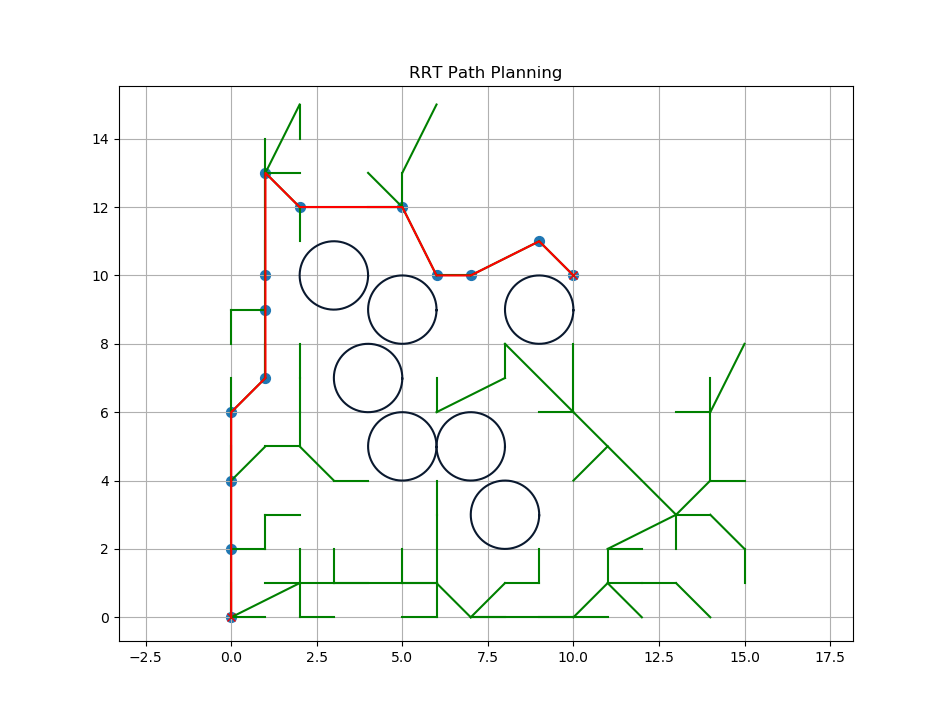

# RRT-CPP
Rapidly-Exploring Random Trees (RRTs, LaValle et al., 1998) implementation in C++17. The use of Ubuntu, C++17, and Python 3.8 is assumed everywhere.

<p align="center">
  
</p>

## Dependencies

`libpython3.8-dev`

`numpy`

## Build Instructions

```
mkdir build && cd build
cmake ..
make
```

You can then run the algorithm by executing `./rrt`

## Configuration

You set different goals and obstacles by changing the config in `Params/config.json`.

## Output

<p align="center">
  
</p>

## References

  
    1. LaValle, Steven M. (October 1998). "Rapidly-exploring random trees: A new tool for path planning" (PDF). Technical Report. Computer Science Department, Iowa State University (TR 98–11).

    2. Howie Choset, James Kuffner. "Robotic Motion Planning: RRT’s". Robotic Motion Planning, 16-735. The Robotics Institute, Carnegie Mellon University.
  

